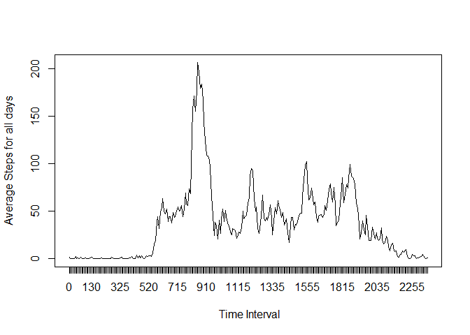

# Reproducible Research: Peer Assessment 1


### Loading and preprocessing the data
It is assumed that the data 'activity.zip' has already downloaded and unzipped onto the local R Markdown working directory.
The data file can be obtained from this address https://d396qusza40orc.cloudfront.net/repdata%2Fdata%2Factivity.zip


```r
#  unzip("activity.zip")
  df_activity <- read.csv("activity.csv")
  df_activity$date<-as.Date(df_activity$date,"%Y-%m-%d")   # convert the date string to date
  cleaned_activity <- subset(df_activity, !is.na(steps))   # remove all steps with NA value
```


### What is mean total number of steps taken per day?
1. Calculate the total number of steps taken per day

```r
  tapply(cleaned_activity$steps,cleaned_activity$date,sum)
```

```
## 2012-10-02 2012-10-03 2012-10-04 2012-10-05 2012-10-06 2012-10-07 
##        126      11352      12116      13294      15420      11015 
## 2012-10-09 2012-10-10 2012-10-11 2012-10-12 2012-10-13 2012-10-14 
##      12811       9900      10304      17382      12426      15098 
## 2012-10-15 2012-10-16 2012-10-17 2012-10-18 2012-10-19 2012-10-20 
##      10139      15084      13452      10056      11829      10395 
## 2012-10-21 2012-10-22 2012-10-23 2012-10-24 2012-10-25 2012-10-26 
##       8821      13460       8918       8355       2492       6778 
## 2012-10-27 2012-10-28 2012-10-29 2012-10-30 2012-10-31 2012-11-02 
##      10119      11458       5018       9819      15414      10600 
## 2012-11-03 2012-11-05 2012-11-06 2012-11-07 2012-11-08 2012-11-11 
##      10571      10439       8334      12883       3219      12608 
## 2012-11-12 2012-11-13 2012-11-15 2012-11-16 2012-11-17 2012-11-18 
##      10765       7336         41       5441      14339      15110 
## 2012-11-19 2012-11-20 2012-11-21 2012-11-22 2012-11-23 2012-11-24 
##       8841       4472      12787      20427      21194      14478 
## 2012-11-25 2012-11-26 2012-11-27 2012-11-28 2012-11-29 
##      11834      11162      13646      10183       7047
```

2. Make a histogram of the total number of steps taken each day


```r
  hist(tapply(cleaned_activity$steps,cleaned_activity$date,sum), main="Histogram of total number of steps per day", xlab="Steps ")
```

 

3. Calculate and report the mean and median of the total number of steps taken per day 

The mean of the total number of steps taken per day


```r
  mean(tapply(cleaned_activity$steps,cleaned_activity$date,sum))
```

```
## [1] 10766.19
```

The median of the total number of steps taken per day


```r
  median(tapply(cleaned_activity$steps,cleaned_activity$date,sum))
```

```
## [1] 10765
```


### What is the average daily activity pattern?
1. Make a time series plot (i.e. type = "l") of the 5-minute interval (x-axis) and the average number of steps taken, averaged across all days (y-axis)


```r
  tbl_avg_steps_interval<- as.table(tapply(cleaned_activity$steps,cleaned_activity$interval,mean))   # stoer the interval names

  plot(tapply(cleaned_activity$steps,cleaned_activity$interval,mean),type="l",xlab=" Time Interval",ylab="Average Steps for all days",xaxt="n")

  axis(1,at=1:288, labels=names(tbl_avg_steps_interval))   # use the table colnames as x-axis unit
```

 

2.Which 5-minute interval, on average across all the days in the dataset, contains the maximum number of steps?


```r
  maxInterval <- names(which.max(tbl_avg_steps_interval))
```
####The 5-minute interval 835 contains the maximum number of steps.
 


### Imputing missing values
1. Calculate and report the total number of missing values in the dataset (i.e. the total number of rows with NAs)


```r
  narows <- sum(is.na(df_activity$steps))
```
####There are  2304 missing values in the dataset.


2. Devise a strategy for filling in all of the missing values in the dataset :- 
   For this I am using the mean of the 5-minute interval to fill in the missing values. I also round the mean values as well.


```r
  intervalMean <- aggregate(steps~interval,df_activity,mean,na.rm=TRUE)
  imputedActivity <- merge(df_activity, intervalMean, by="interval")
  imputedActivity <- transform(imputedActivity,steps.x = round(ifelse(is.na(steps.x),steps.y,steps.x),0))
```

3. Create a new dataset that is equal to the original dataset but with the missing data filled in.


```r
  newdf_activity <- data.frame(imputedActivity[,1:3])
  names(newdf_activity) <- c("interval","steps", "date")
```

4. Make a histogram of the total number of steps taken each day and Calculate and report the mean and median total number of steps taken per day. Do these values differ from the estimates from the first part of the assignment? What is the impact of imputing missing data on the estimates of the total daily number of steps?


```r
  hist(tapply(newdf_activity$steps,newdf_activity$date,sum), main="Histogram of total number of steps per day", xlab="Steps")
```

 

The mean of the total number of steps taken per day for revised dataset


```r
  mean(tapply(newdf_activity$steps,newdf_activity$date,sum))
```

```
## [1] 10765.64
```

The median of the total number of steps taken per day for revised dataset


```r
  median(tapply(newdf_activity$steps,newdf_activity$date,sum))
```

```
## [1] 10762
```

The impact of the imputing missing data has little significant on the mean and median of the total number of steps taken per day.


### Are there differences in activity patterns between weekdays and weekends?

1. Create a new factor variable in the dataset with two levels – “weekday” and “weekend” indicating whether a given date is a weekday or weekend day.


```r
  newdf_activity$dayCategory <- ifelse(weekdays(newdf_activity$date) %in% c("Saturday", "Sunday"),"Weekend", "Weekday")
```

2. Make a panel plot containing a time series plot (i.e. type = "l") of the 5-minute interval (x-axis) and the average number of steps taken, averaged across all weekday days or weekend days (y-axis). 


```r
  df_daycategory <- aggregate(steps ~ interval + dayCategory, newdf_activity, mean)
  names(df_daycategory) <- c("interval","dayCategory","avgSteps")
  library(datasets)
  library(lattice)
  xyplot(avgSteps ~ interval | dayCategory, data=df_daycategory, type="l", xlab="Interval", ylab="Average number of steps",layout=c(1,2))
```

 

The plot above shows there are more peaks across the intervals on weekends as to weekdays. This possily due to the office hours constraint on the weekdays which causes less activities across the working hours. 
